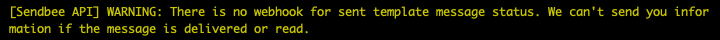
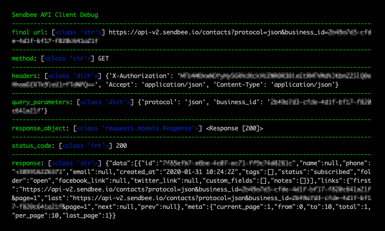

# Sendbee Python API Client  

```

                .' '.            __
       .        .   .           (__\_
        .         .         . -{{_(|8)
          ' .  . ' ' .  . '     (__/

```  

[](https://badge.fury.io/py/sendbee-api)
[](https://travis-ci.org/sendbee/sendbee-python-api-client)


## Table of contents  

-   [Installation](#installation)  
-   [Initialization](#initialization)    

#### Contacts  

-   [Fetch contacts](#fetch-contacts)  
-   [Subscribe contact](#subscribe-contact)  
-   [Update contact](#update-contact)  

#### Contact Tags  

-   [Fetch contact tags](#fetch-contact-tags)  
-   [Create contact tag](#create-contact-tag)  
-   [Update contact tag](#update-contact-tag)  
-   [Delete contact tag](#delete-contact-tag)  

#### Contact Fields  

-   [Fetch contact fields](#fetch-contact-fields)  
-   [Create contact field](#create-contact-field)  
-   [Update contact field](#update-contact-field)  
-   [Delete contact field](#delete-contact-field)  

#### Conversations  

-   [Fetch conversations](#fetch-conversations)
-   [Fetch conversation messages](#fetch-conversation-mesages)
-   [Fetch message templates](#fetch-message-templates)  
-   [Send template message](#send-template-message)  
-   [Send message](#send-message)  

#### Automation  

-   [Managing chatbot (automated responses) status settings](#bot-on-off)  

#### Mics  

-   [Pagination](#pagination)
-   [Raw response](#raw-response)
-   [Exception handling](#exception-handling)  
-   [Authenticate webhook request](#authenticate-webhook-request)  
-   [Warnings](#warnings)  
-   [Debugging](#debugging)  
-   [Official Documentation](http://developer.sendbee.io)  

### <a href='installation'>Installation</a>  

```bash
> pip install sendbee-api
```

### <a href='initialization'>Initialization</a>  

```python
from sendbee_api import SendbeeApi

api = SendbeeApi('__your_api_key_here__', '__your_secret_key_here__')
```

## Contacts

### <a href='fetch-contacts'>Fetch contacts</a>  

```python
contacts = api.contacts(
    [tags=['...', ...]], [status='subscribed|unsubscribed'], 
    [search_query='...'], [page=...]
)

for contact in contacts:
    contact.id
    contact.status
    contact.folder
    contact.created_at
    
    contact.name
    contact.phone
    contact.email
    contact.twitter_link
    contact.facebook_link
    
    for tag in contact.tags:
        tag.id
        tag.name
    
    for note in contact.notes:
        note.value
    
    for contact_field in contact.contact_fields:
        contact_field.key
        contact_field.value
```

### <a href='subscribe-contact'>Subscribe contact</a>  

```python
contact = api.subscribe_contact(
    phone='+...',
    # this is mandatory the most important information
    # about the subscribing contact
    
    [tags=['...', ...]], 
    # tag new contact
    # if tag doesn't exist, it will be created
    
    [name='...'], [email='...'],
    [facebook_link='...'],[twitter_link='...'],
    [address={
        'line': '...',
        'city': '...',
        'postal_code': '...'
    }],
    
    [notes=[...]], 
    # write notes about your new subscriber
    
    [contact_fields={'__field_name__': '__field_value__', ...}],
    # fill contact fields with your data (value part)
    # contact fields must be pre-created in Sendbee Dashboard
    # any non-existent field will be ignored 
    
    [block_notifications=[True|False]],
    # prevent sending browser push notification and email 
    # notification to agents, when new contact subscribes
    # (default is True) 
    
    [block_automation=[True|False]]
    # prevent sending automated template messages to newly
    # subscribed contact (if any is set in Sendbee Dashboard) 
    # (default is True) 
)

contact.id
contact.status
contact.folder
contact.created_at

contact.name
contact.phone
contact.email
contact.twitter_link
contact.facebook_link

for tag in contact.tags:
    tag.id
    tag.name

for note in contact.notes:
    note.value

for contact_field in contact.contact_fields:
    contact_field.key
    contact_field.value
```

### <a href='update-contact'>Update contact</a>  

```python
contact = api.update_contact(
    id='...',
    # contact is identified with ID
    
    [phone='+...'],
    # this is the most important information 
    # about the subscribing contact
    
    [tags=['...', ...]], 
    # tag new contact
    # if tag doesn't exist, it will be created
    
    [name='...'], [email='...'],
    [facebook_link='...'],[twitter_link='...'],
    [address={
        'line': '...',
        'city': '...',
        'postal_code': '...'
    }],
    
    [notes=[...]], 
    # write notes about your new subscriber
    # if there are notes already saved for this contact
    # new notes will be appended
    
    [contact_fields={'__field_name__': '__field_value__', ...}],
    # fill contact fields with your data (value part)
    # contact fields must be pre-created in Sendbee Dashboard
    # any non-existent field will be ignored 
    # if there are fields already filled with data for this contact
    # it will be overwritten with new data 
)

contact.id
contact.status
contact.folder
contact.created_at

contact.name
contact.phone
contact.email
contact.twitter_link
contact.facebook_link

for tag in contact.tags:
    tag.id
    tag.name

for note in contact.notes:
    note.value

for contact_field in contact.contact_fields:
    contact_field.key
    contact_field.value
```

## Contact tags

### <a href='fetch-tags'>Fetch contact tags</a>  

```python
tags = api.tags([name='...'], [page=...])

for tag in tags:
    tag.id
    tag.name
```

### <a href='create-contact-tag'>Create contact tag</a>  

```python
tag = api.create_tag(name='...')

tag.id
tag.name
```

### <a href='update-contact-tag'>Update contact tag</a>  

```python
tag = api.update_tag(id='...', name='...')

tag.id
tag.name
```

### <a href='delete-contact-tag'>Delete contact tag</a>  

```python
response = api.delete_tag(id='...')

response.message
```

## Contact fields

### <a href='fetch-contact-fields'>Fetch contact fields</a>  

```python
contact_fields = api.contact_fields([search_query='...'], [page=...])

for contact_field in contact_fields:
    contact_field.slug
    contact_field.name
    contact_field.type
    
    if contact_field.type == 'list':
        contact_field.options
```

### <a href='create-contact-field'>Create contact field</a>  

If a contact field type is a list, then you need to send a list options.  
List options is a list of option names: `['option1', 'option2', ...]`  

```python
contact_field = api.create_contact_field(
    name='...', type='text|number|list|date|boolean',
    [options=['...'. ...]] # if contact field type is list
)

contact_field.id
contact_field.slug
contact_field.name
contact_field.type

if contact_field.type == 'list':
    contact_field.options
```

### <a href='update-contact-field'>Update contact field</a>  

If a contact field type is a list, then you need to send a list options.  
List options is a list of option names: `['option1', 'option2', ...]`  

```python
contact_field = api.update_contact_field(
    id='...', [name='...'], [type='text|number|list|date|boolean'],
    [options=['...'. ...]] # if contact field type is list
)

contact_field.id
contact_field.slug
contact_field.name
contact_field.type

if contact_field.type == 'list':
    contact_field.options
```

### <a href='delete-contact-field'>Delete contact field</a>  

```python
response = api.delete_contact_field(id='...')

response.message
```

## Conversations

### <a href='fetch-conversations'>Fetch conversations</a>  

```python
conversations = api.conversations(
    [folder='open|done|spam|notified'], [search_query='...'], [page=...]
)

for conversation in conversations:
    conversation.id
    conversation.folder
    conversation.chatbot_active
    conversation.platform
    conversation.created_at
    
    conversation.contact.id
    conversation.contact.name
    conversation.contact.phone
    
    conversation.last_message.direction
    conversation.last_message.status
    conversation.last_message.inbound_sent_at
    conversation.last_message.outbound_sent_at
```

### <a href='fetch-conversation-messages'>Fetch conversation messages</a>  

```python
messages = api.messages(conversation_id='...', [page=...])

for message in messages:
    message.type
    message.body
    message.media_type
    message.media_url
    message.status
    message.direction
    message.sent_at
```

### <a href='fetch-message-templates'>Fetch message templates</a>  

```python
templates = api.message_templates(
    [approved=True|False], [search_query='...'], [page=...]
)

for template in templates:
    template.id
    template.text
    template.tags
    template.keyword
    template.language
    template.approved
```

### <a href='send-template-message'>Send template message</a>  

```python
response = api.send_template_message(
    phone='+...',
    
    template_keyword='...',
    # every pre-created and approved message template
    # is identified with a keyword
    
    language='...', 
    # language keyword
    # example: en (for english)
    
    tags={'__tag_key__': '__tag_value__', ...}
    # tags for template messages are parts of the message that need
    # to be filled with your custom data
    # example:
    # template message: "Welcome {name}! How can we help you?"
    # tags: {"name": contact.name}
)

response.status
response.conversation_id
# save this id, and when you get sent message status requests on
# your webhook, you'll get this same id to identify the conversation

```

### <a href='send-message'>Send message</a>  

You can send either text message or media message.  
For media message, following formats are supported:  

Category | Formats
-------- | -------
Audio | AAC, M4A, AMR, MP3, OGG OPUS
Video | MP4, 3GPP
Image | JPG/JPEG, PNG
Document | PDF, DOC, DOCX, PPT, PPTX, XLS, XLSX  

```python
response = api.send_message(
    phone='+...',
    
    [text='...'],
    # any kind of message text
    
    [media_url='...']
    # URL to a media. 
    # you need to upload it your self and send us the URL
)

response.status
response.conversation_id
# save this id, and when you get sent message status requests on
# your webhook, you'll get this same id to identify the conversation

```

## Automation

### <a href='#bot-on-off'>Managing chatbot (automated responses) status settings</a>  

Every contact is linked to a conversation with an agent.  
Conversation could be handled by an agent or a chatbot (automated responses).  
Every time a message has been sent to a contact by an agent or using the API, the chatbot will automatically be turned off for that conversation.  
Use the example below to change the chatbot status based on your use case.    

```python
api.chatbot_activity(conversation_id='...', active=True|False)
```

## Misc  

### <a href='pagination'>Pagination</a>  

You can paginate on every endpoint/method where a list of something is fetching.  
Wherever you see `[page=...]` it means you can paginate like `page=2`, `page=3`, etc. The best way to do that is to use `.next_page()` method.  

There are two ways to detect that pagination ended, using `PaginationException` and using `.has_next()` method.

> Paginate using .next_page() and PaginationException:   

```python
from sendbee_api import PaginationException

messages = api.messages(conversation_id='...') # first page
while True:
    try:
        messages = api.messages(
            conversation_id='...', page=messages.next_page()
        )
    except PaginationException as e:
        break
```  

> Paginate using .next_page() and .has_next() methods:   

```python
messages = api.messages(conversation_id='...') # first page
while True:
    if not messages.has_next():
        break
    messages = api.messages(
        conversation_id='...', page=messages.next_page()
    )
```     

### <a href='raw-response'>Raw response</a>  

If you prefer to deal with the raw server response, response string is available under raw_data

```python
from sendbee_api import SendbeeApi

api = SendbeeApi('__your_api_key_here__', '__your_secret_key_here__')

response = api.contacts()

print(response.raw_data)
```


### <a href='exception-handling'>Exception handling</a>  

Every time something is not as it should be, like parameter is missing, parameter value is invalid, authentication fails, etc, API returns a http status code accordingly and an error message.  
By using this client library, an error message is detected and taken, and an exception is raised, so you can handle it like this:  

```python
from sendbee_api import SendbeeRequestApiException

try:
    api.send_template_message(...)
except SendbeeRequestApiException as e:
    # handle exception
```    

### <a href='authenticate-webhook-request'>Authenticate webhook request</a>  

After activating your webhook URL in Sendbee Dashboard, we will start sending requests on that URL depending on which webhook type is linked with that webhook URL.  
Every request that we make will have authorization token in header, like this:  

```
{
    ...
    'X-Authorization': '__auth_token_here__',
    ...
}
```

To authenticate requests that we make to your webhook URL, take this token from request header and check it using Sendbee API Client:  

```python
from sendbee_api import SendbeeApi

api = SendbeeApi('__your_api_key_here__', '__your_secret_key_here__')

token = '...'  # taken from the request header
if not api.auth.check_auth_token(token):
    # error! authentication failed!
```  

### <a href='warnings'>Warnings</a>  

Sometimes APi returns a worning so you could be warned about something.  
The waning is displayed in standard output:  

  

### <a href='debugging'>Debugging</a>  

This library has it's own internal debugging tool.  
By default it is disabled, and to enable it, pass the `debug` parameter:  

```python
from sendbee_api import SendbeeApi

api = SendbeeApi(
    '__your_api_key_here__', '__your_secret_key_here__', debug=True
)
```  

Once you enabled the internal debug tool, every request to API will output various request and response data in standard output:  

   
